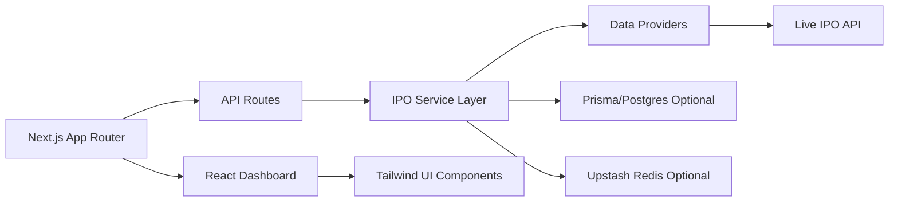
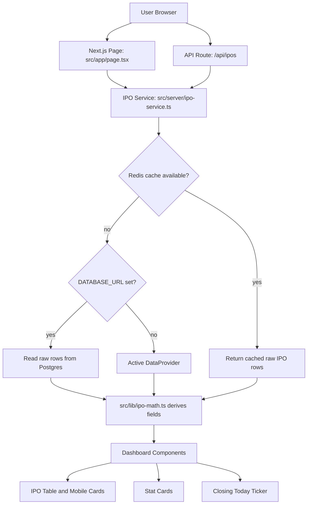
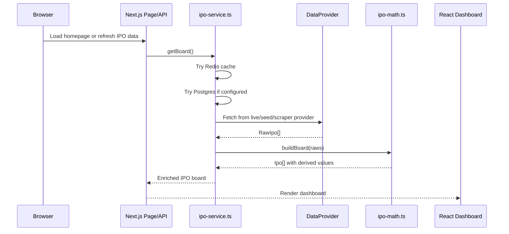
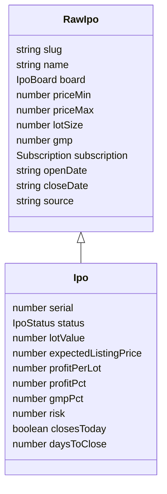
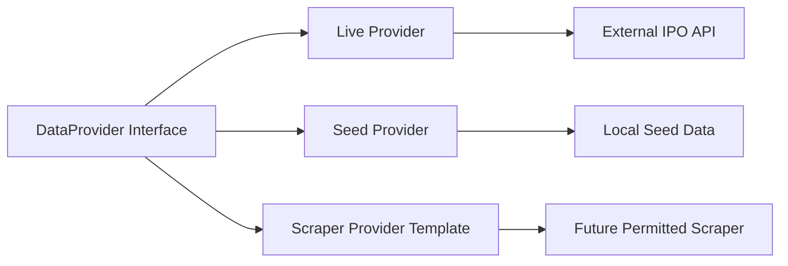

# IPO Pulse

IPO Pulse is a live Indian IPO dashboard built with Next.js. It tracks open IPOs,
subscription demand, lot value, estimated listing gain, profit per lot, risk
score, and IPOs closing today.

The project is designed as a portfolio-ready full-stack app: the UI is clean and
interactive, the data source is replaceable, and the business calculations are
kept separate from React components.

> Disclaimer: IPO Pulse is for education and portfolio demonstration only. GMP
> is unofficial and can be missing or inaccurate. This app is not investment
> advice.

## Live Demo

```text
Vercel URL: add your deployed URL here
GitHub: https://github.com/padalasuraj/IPO-Pulse
```

## Tech Stack




## What This App Does

- Shows currently open IPOs from a live IPO API.
- Displays price band, lot size, lot value, subscription, GMP, estimated listing
  price, profit per lot, and risk.
- Highlights IPOs closing today.
- Supports search, status filters, board filters, sorting, and manual refresh.
- Uses a provider pattern so the data source can be changed without rewriting
  the UI.
- Supports optional Postgres persistence, Redis caching, Vercel cron refresh,
  and an optional background worker.

## Interview Explanation

You can explain the project like this:

> IPO Pulse is a Next.js dashboard for tracking Indian IPOs. The app fetches raw
> IPO data through a provider adapter, then the service layer decides whether to
> use cache, database, or the live provider. After that, a pure calculation layer
> derives values like lot value, estimated listing price, profit per lot, GMP
> percentage, status, and risk score. The React dashboard receives already
> enriched data and focuses only on filters, sorting, refresh, and presentation.

The most important design decision is the separation between:

- Raw data from providers: `RawIpo`
- Derived UI-ready data: `Ipo`
- UI rendering: React components
- Infrastructure: Redis, Prisma, cron, worker

This makes the project easier to maintain because formulas, UI, and data source
logic are not mixed together.

## Architecture



## Request/Data Flow



## Folder Structure

```text
ipo-pulse/
  src/
    app/                     Next.js App Router pages and API routes
    components/              React dashboard UI components
    data/                    Local seed/demo IPO data
    lib/                     Shared types, calculations, DB, Redis, utilities
    server/                  Server-side data service and provider adapters
    worker/                  Optional background refresh worker

  prisma/                    Prisma schema and seed script
  docs/                      Extra architecture notes
  public/                    Static public assets
  vercel.json                Vercel cron/function configuration
```

## Code Map: Which File Does What

| File | Purpose |
| --- | --- |
| `src/lib/types.ts` | Defines the domain models: `RawIpo`, `Ipo`, board, status, subscription, risk band. |
| `src/lib/ipo-math.ts` | Pure business logic. Calculates lot value, expected listing price, profit per lot, GMP percentage, risk score, status, and sorting. |
| `src/server/ipo-service.ts` | Main server service. Reads from cache, database, or provider, then builds the enriched board. Also handles refresh logic. |
| `src/server/data-provider/index.ts` | Selects the active provider using `DATA_PROVIDER`. |
| `src/server/data-provider/live-provider.ts` | Calls the live IPO API, validates data with Zod, and maps external rows into `RawIpo`. |
| `src/server/data-provider/seed-provider.ts` | Returns local demo IPO data for development or fallback. |
| `src/server/data-provider/scraper-provider.ts` | Template for a future permitted scraper-based provider. |
| `src/app/page.tsx` | Server-rendered homepage. Loads IPO data and passes it to the dashboard. |
| `src/app/api/ipos/route.ts` | API endpoint for refreshing/fetching the full IPO board. |
| `src/app/api/ipos/closing-today/route.ts` | API endpoint for IPOs closing today. |
| `src/app/api/cron/refresh/route.ts` | Cron endpoint used by Vercel to refresh data. |
| `src/components/dashboard.tsx` | Client-side dashboard state: search, filters, sort, refresh, and selected view. |
| `src/components/ipo-table.tsx` | Desktop table and mobile IPO cards. |
| `src/components/ipo-filters.tsx` | Search bar, board filter, status filter, and sort controls. |
| `src/components/stat-cards.tsx` | Top summary cards such as open IPO count and top profit per lot. |
| `src/components/emergency-ticker.tsx` | Highlights IPOs whose last application date is today. |
| `src/components/ipo-visuals.tsx` | Reusable display parts: badges, profit text, subscription bar, risk meter. |
| `src/lib/db.ts` | Optional Prisma client setup. |
| `src/lib/redis.ts` | Optional Upstash Redis cache wrapper. |
| `src/worker/worker.ts` | Optional long-running BullMQ worker for scheduled refresh outside Vercel. |
| `prisma/schema.prisma` | Database schema for storing raw IPO rows. |
| `vercel.json` | Vercel cron schedule and serverless function settings. |

## Core Data Model



## Calculation Logic

All important calculations live in `src/lib/ipo-math.ts`.

```text
lotValue = priceMax * lotSize
expectedListingPrice = priceMax + gmp
profitPerLot = (expectedListingPrice - priceMax) * lotSize
profitPct = profitPerLot / lotValue * 100
gmpPct = gmp / priceMax * 100
```

Because `expectedListingPrice = priceMax + gmp`, the simplified profit formula
for open IPOs is:

```text
profitPerLot = gmp * lotSize
```

Example:

```text
priceMax = 140
lotSize = 107
gmp = 10

profitPerLot = 10 * 107 = 1070
```

If the live API does not provide GMP, the app currently treats GMP as `0`.
That means profit per lot will also display as `0` until a GMP value is
available from the data source.

## Provider Pattern

The app uses a provider interface so data sources can be replaced easily.



Current providers:

| Provider | Use case |
| --- | --- |
| `live` | Production-style live API data. |
| `seed` | Offline/local demo data. |
| `scraper` | Template for future scraping, intended for a worker host, not Vercel. |

## API Routes

| Route | Purpose |
| --- | --- |
| `/` | Server-rendered dashboard page. |
| `/api/ipos` | Returns the full enriched IPO board. |
| `/api/ipos/closing-today` | Returns open IPOs closing today. |
| `/api/cron/refresh` | Refreshes provider data, persists it if DB is configured, and warms cache. |

## Environment Variables

Copy `.env.example` to `.env` for local overrides.

| Variable | Required | Purpose |
| --- | --- | --- |
| `DATA_PROVIDER` | No | `live`, `seed`, or `scraper`. Defaults to live behavior in production-style usage. |
| `LIVE_IPO_API_URL` | No | Base URL for the live IPO API. |
| `DATABASE_URL` | No | Optional Postgres database connection for persistence. |
| `UPSTASH_REDIS_REST_URL` | No | Optional Upstash Redis REST URL for cache. |
| `UPSTASH_REDIS_REST_TOKEN` | No | Optional Upstash Redis REST token. |
| `REDIS_URL` | No | Optional TCP Redis URL for BullMQ worker. |
| `CRON_SECRET` | Recommended | Protects the cron refresh endpoint. |
| `NEXT_PUBLIC_APP_NAME` | No | Public app name used by the frontend. |

## Local Development

```powershell
npm install
npm run dev
```

Open:

```text
http://localhost:3000
```

Useful commands:

```powershell
npm run dev       # start local development server
npm run build     # production build
npm run lint      # lint the project
npm run db:push   # push Prisma schema to configured Postgres
npm run db:seed   # seed Postgres with sample IPO data
npm run worker    # run optional background worker
```

## Deployment

The Next.js app is designed to deploy on Vercel.

Recommended Vercel settings:

```text
Framework Preset: Next.js
Root Directory: ./
Install Command: npm install
Build Command: npm run build
Output Directory: blank/no value
```

Recommended environment variables on Vercel:

```text
DATA_PROVIDER=live
LIVE_IPO_API_URL=https://ipo-tracker-api-lxje.onrender.com
CRON_SECRET=your-secret-value
NEXT_PUBLIC_APP_NAME=IPO Pulse
```

The optional BullMQ worker should run on a persistent host such as Railway,
Render, Fly.io, or a VPS. Vercel serverless functions are not intended for
long-running workers or Playwright scraping.

## Current Limitation

The default live API is not owned by this project. It may not provide GMP for
every IPO. When GMP is missing, the app displays `0` for GMP-based values such
as expected listing gain and profit per lot.

For production, replace the current live API with an official/permitted source,
a paid data provider, or your own backend data pipeline.

## Why This Project Is Interview-Worthy

- It has a real-world domain with changing live data.
- It separates provider data, service orchestration, business math, and UI.
- It uses TypeScript types to keep the data contract clear.
- It validates external API data with Zod.
- It supports optional caching and persistence without making them mandatory.
- It is deployable on Vercel with cron-based refresh.
- It includes practical tradeoffs around unofficial GMP data and external APIs.

## Future Improvements

- Add a permitted GMP data source.
- Show `N/A` instead of `0` when GMP is missing.
- Add unit tests for `src/lib/ipo-math.ts`.
- Add database-backed historical IPO performance.
- Add admin/manual overrides for GMP values.
- Add charts for subscription and expected listing gain trends.
